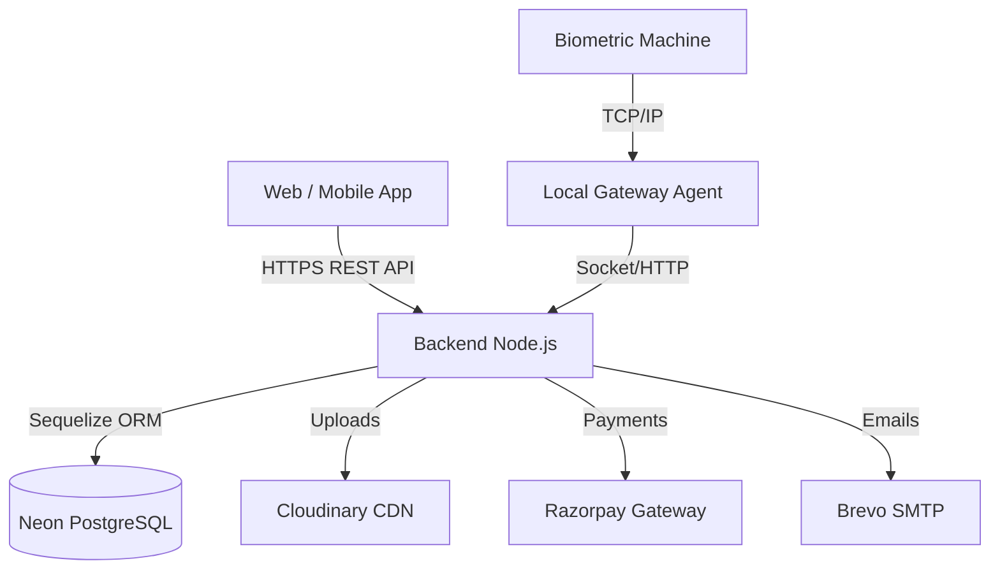

# 🎓 ZenithFlows IMS – Multi-Tenant Coaching ERP System

<p align="center">
  
  
  
  
  
  
</p>

## 🎯 Project Aim & Goal

**ZenithFlows IMS** is a scalable, multi-tenant Software-as-a-Service (SaaS) platform designed specifically for coaching institutes and educational organizations. 

**Our Goal:** To digitize and streamline the day-to-day operations of educational institutes by providing a unified platform for administration, faculty, students, and parents. This system aims to eliminate manual paperwork, automate fee collections, provide real-time attendance tracking (including biometric integration), and deliver comprehensive academic analytics.

## 🏢 Services & Modules Provided

1. **Multi-Tenant Architecture:** Secure data isolation for multiple institutes under a single Super Admin dashboard.
2. **User Roles:** Distinct portals and mobile apps for Super Admin, Institute Admin, Faculty, Students, and Parents.
3. **Academic Management:** Class, subject, and syllabus management.
4. **Attendance Tracking:** Manual attendance and automated biometric (fingerprint/RFID) integration via a local gateway agent.
5. **Exam & Results:** Test creation, marks entry, and automated report card generation.
6. **Finance & Subscriptions:** Fee management for students and automated SaaS subscription billing for institutes via Razorpay.
7. **Communication:** Integrated email (via Brevo) and push notifications (via Firebase) for instant alerts.

---

## 🛠 Technology Stack & Plugins

### **Frontend (Web & Mobile)**
- **Framework:** React.js (v18) with Vite
- **Mobile App:** Capacitor (Android/Universal APK generation)
- **State Management & Fetching:** React Query (Tanstack), Axios
- **UI & Visualization:** Chart.js, Recharts, React Icons
- **Utilities:** HTML2Canvas, JSPDF (for report generation), QRCode
- **Monitoring:** Sentry for React

### **Backend (API)**
- **Environment:** Node.js (v18+)
- **Framework:** Express.js
- **Database ORM:** Sequelize
- **Security:** Helmet, XSS, CORS, Rate Limiting, JWT Authentication, Bcrypt
- **Caching:** Redis (Upstash) / Node-cache
- **File Uploads:** Multer with Cloudinary Storage
- **Task Scheduling:** Node-cron

### **Database & Infrastructure**
- **Primary Database:** PostgreSQL (Hosted on Neon)
- **Local Gateway:** Custom `gateway-agent` (Node.js) for biometric device LAN communication

### **Third-Party Services & Integrations**
- **Payment Gateway:** Razorpay
- **Email Service:** Brevo (SMTP Relay)
- **Cloud Storage:** Cloudinary (Profile pictures, documents)
- **Push Notifications & Auth:** Firebase Admin SDK

---

## 🚀 Deployment Environment

Based on the environment configuration, the project components are distributed across the following cloud providers:

| Component | Provider / Platform | Details / URL |
| :--- | :--- | :--- |
| **Frontend (Web Dashboard)** | **Vercel** | Hosted via `vercel.json` |
| **Backend (Node.js API)** | **Railway / Render** | Hosted via `railway.json` / Hostinger VPS |
| **Database** | **Neon** | Serverless PostgreSQL (`neondb`) |
| **Media / Storage** | **Cloudinary** | Image & asset storage |
| **Emails** | **Brevo** | SMTP Relay (`smtp-relay.brevo.com`) |
| **Payments** | **Razorpay** | SaaS subscription & fee collection |

---

## 🏗 Project Architecture

The repository is structured as a monorepo, separating the frontend application, the backend API, and local agents.

### **High-Level Directory Structure**
```text
zenithflows-ims/
│
├── backend/                  # Node.js + Express API
│   ├── config/               # DB and third-party configs
│   ├── controllers/          # Business logic
│   ├── middlewares/          # Auth, roles, error handlers
│   ├── migrations/           # Database schema migrations
│   ├── models/               # Sequelize PostgreSQL models
│   ├── routes/               # API endpoint definitions
│   └── services/             # Reusable service classes/functions
│
├── frontend/                 # React.js + Vite Application
│   ├── android/              # Capacitor Android project files
│   ├── public/               # Static assets
│   ├── scripts/              # Mobile build and patch scripts
│   └── src/
│       ├── components/       # Reusable UI components
│       ├── pages/            # Page views (Admin, Student, Faculty)
│       └── utils/            # API clients and helpers
│
└── gateway-agent/            # Local Node.js agent for Biometric devices
    ├── config.json
    └── agent.js
```

### **System Data Flow**


---

## 💻 Local Development Setup

### 1. Prerequisites
- Node.js (v18 or higher)
- PostgreSQL (Local or Neon URL)
- Android Studio (For Capacitor mobile builds)

### 2. Backend Setup
```bash
cd backend
npm install
# Configure your .env file
npm run dev
```

### 3. Frontend Setup
```bash
cd frontend
npm install
# Configure your .env or .env.mobile.universal
npm run dev
```

### 4. Database Migrations
To run all startup migrations on a fresh database:
```bash
cd backend
npm run migrate:safe
```

## 🔒 Security Standards Implemented
- **Data Isolation:** All tenant queries enforce `where: { institute_id: req.user.institute_id }`.
- **JWT & Role-based Authorization:** Strict middleware (`verifyToken`, `allowRoles`).
- **SQL Injection Prevention:** Parametrized queries via Sequelize ORM.
- **Rate Limiting & Helmet:** API endpoints secured against spam and common web vulnerabilities.
